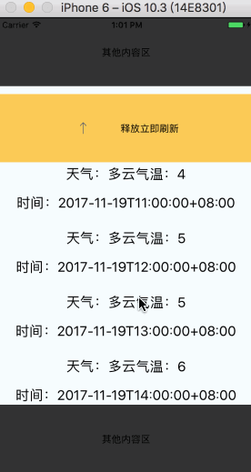
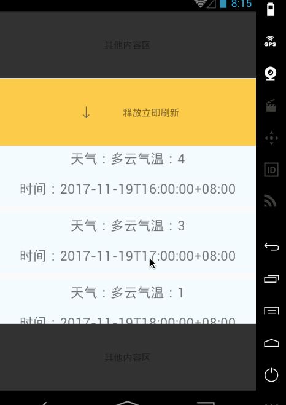

# react-native-smart-refresh-flatlist



### Documentation
用React Native也有一段时间了，受到以前做的电商项目做下拉刷新的灵感，基于目前flatlist并没有可以自定义的拉头，且react-native-pull有着各种问题还未解决，于是决定基于react-native-pull自己写一个，顺便锻炼一下自己的React Native 手势和动画的技能，最后说一句，站在巨人肩膀真的可以看的更远。
### Features
- [x] 基于Flatlist组件封装
- [x] 可自定义的下拉刷新 
- [x] 可自定义的上拉加载 
- [x] 可自定义的加载动画、网络请求失败、无数据页面 
- [x] 解决了react-native-pull的issues大部分问题
- [x] 兼容ios android两端至最新版本（目前为0.50） 
- [x] ......

#### Params

|Key | Description | Type | Default|
| --- | ----------- | ---- | ------ |
|AsycConnectedChange  |   检测网络的事件（低版本change 高版本 connectionChange ）  |string  | 'change'
|topBackgroundColor         |   下拉显示器的背景色  |string  | '#eca02a'
|renderItem   |  flatlist的属性        |function   |  |
|initialPage          |  默认的起始页码      |number  |0                           |
|pageSize      |   每页的数量       |number  |10                          |
|onFetch      |   fetch方法        | function  |  onFetch(page, pageSize, callback)     |
|topIndicatorHeight       |   显示器的高度      |number   |100                        |
|pullOkMargin       |   下拉到ok状态时topindicator距离顶部的距离     |number   |100       |
|duration         |   动画的延迟时间             |number   |300          |
|footerLoading    |   列表底部加载中的组件   |function  |                     |               
|loadingNoMore       | 列表底部没有更多数据的组件           |function   |                |      
|loadingMore  | 列表底部加载更多的组件 |function   |  loadingMore(_getMore)   |      
|noDataView   | 列表请求数据为空的组件 |function   | noDataView(_rePostFetch)   |      
|errorView  | 列表请求数据失败的组件  |function   |  errorView(_rePostFetch)  |      
|topIndicatorRender| 刷新显示器组件|function|topIndicatorRender(pulling, pullok, pullrelease, pullSuccess, this.gesturePosition)   |   


### Usage

#### Step 1 - install

```
	npm install react-native-smart-refresh-flatlist --save
```


#### Step 2 - import and use in project
#####on Android
###### in AndroidManifest.xml
```javascript
   <uses-permission android:name="android.permission.ACCESS_NETWORK_STATE" />
```

```javascript
    import SmartFlatList from 'react-native-smart-refresh-flatlist'
```
```javascript
    constructor(props) {
        super(props);
        this.state = {}
    }

    async onFetch(page, pageSize, callback) {
        // do something for fetch data
        await this.fetch().then((response) => {
            !response ? callback('', '', true) : callback(response.hourly, response.sum)
        });
    }
    render(){
        return  <SmartFlatList
                    topBackgroundColor={'#fccb57'}
                    initialNumToRender={7}
                    renderItem={(data) => this.renderItem(data)}
                    initialPage={1}
                    pageSize={10}
                    onFetch={this.onFetch.bind(this)}
                />
    }
	...
```
### Reference

https://github.com/gzfgeh/RefreshListDemo
https://github.com/greatbsky/react-native-pull
https://github.com/FaridSafi/react-native-gifted-listview
#### Finally
如果对rn源码里的art有兴趣也可以打开源码的注释看看，不过ios需要配置
如果喜欢，请顺手我一个star，非常感谢~ ：）

